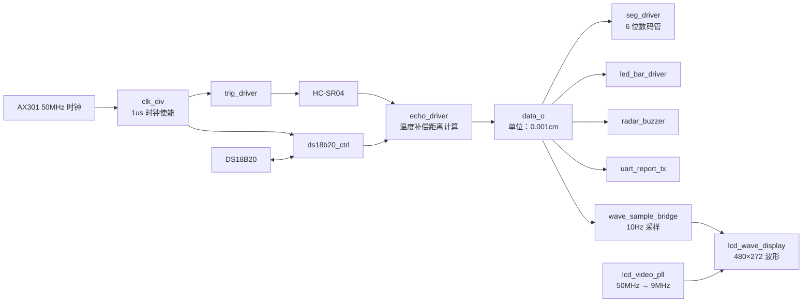

# FPGA 超声波测距与实时波形显示系统

基于 **AX301（EP4CE6F17C8）** 开发板实现的超声波测距系统。工程使用 HC-SR04 获取距离，结合 DS18B20 环境温度进行声速补偿，并将结果同步显示在数码管、LED 距离条、蜂鸣器、串口和 AN430 RGB LCD 上。

LCD 以实时曲线展示最近约 11 秒内的距离变化，适合用于 FPGA 外设驱动、跨时钟域处理、定点运算和人机交互的综合实践。

## 功能概览

- HC-SR04 超声波测距：每 100ms 触发一次，统计 `ECHO` 高电平宽度。
- DS18B20 温度补偿：读取整数摄氏温度，依据温度修正声速后计算距离。
- 6 位数码管显示：以 `xxx.xxx cm` 格式显示当前距离。
- LED 距离条：距离越近，点亮的 LED 越多。
- 蜂鸣器报警：距离越近，提示音越急；近距离持续鸣叫。
- UART 上报：`115200 bps / 8N1`，周期发送距离与温度文本。
- AN430 4.3 英寸 RGB LCD：显示 0–300cm 的实时距离波形。
- 跨时钟域处理：通过稳定数据总线与翻转标志，把 50MHz 域样点传递到 9MHz LCD 域。

## 系统框图



## LCD 波形显示

| 项目 | 当前配置 |
| --- | --- |
| LCD 分辨率 | 480 × 272 |
| 像素时钟 | 9MHz |
| 距离采样周期 | 100ms（10Hz） |
| 历史样点数 | 110 点 |
| 时间窗口 | 约 11 秒 |
| 纵轴范围 | 0–300cm |
| 横向网格 | 1 秒 / 格 |
| 纵向网格 | 50cm / 格 |
| 曲线颜色 | 亮绿色 |

波形使用环形历史缓存：左侧为较早样点，右侧为最新距离。超出 300cm 的距离会钳位显示在图表顶部。

## 距离与报警规则

工程内部距离统一采用 **0.001cm** 作为单位。例如 `19'd123456` 代表 `123.456cm`。

| 距离范围 | LED | 蜂鸣器 |
| --- | --- | --- |
| `distance = 0` 或 `> 100cm` | 全灭 | 关闭 |
| `(75, 100]cm` | 1 个点亮 | 慢速间歇 |
| `(50, 75]cm` | 2 个点亮 | 中速间歇 |
| `(25, 50]cm` | 3 个点亮 | 快速间歇 |
| `(0, 25]cm` | 4 个点亮 | 持续鸣叫 |

## 串口输出

串口固定为 `115200 bps`、`8N1`、无校验位。系统约每秒输出一帧文本，例如：

```text
D=123.456cm,T=+020C\r\n
```

- `D`：温度补偿后的距离；
- `T`：DS18B20 读取的整数摄氏温度；
- `uart_rx` 已接入顶层，当前保留用于后续增加阈值或显示模式等控制命令。

## 硬件与连接

### 目标平台

| 项目 | 配置 |
| --- | --- |
| 开发板 | ALINX AX301 |
| FPGA | Intel Cyclone IV E EP4CE6F17C8 |
| 系统时钟 | 板载 50MHz |
| 工具链 | Quartus Prime 18.1 Lite Edition |
| 仿真工具 | ModelSim - Intel FPGA Edition |

### 主要 I/O

| 外设/信号 | 顶层端口 | FPGA 引脚 | 说明 |
| --- | --- | --- | --- |
| 系统时钟 | `clk` | `E1` | AX301 板载 50MHz 时钟 |
| 复位按键 | `rstn` | `N13` | 低有效 |
| HC-SR04 触发 | `trig` | `T14` | J1-3 |
| HC-SR04 回响 | `echo` | `R13` | J1-4 |
| DS18B20 数据 | `ds18b20_dq` | `T13` | 单总线 DQ |
| UART 发送/接收 | `uart_tx` / `uart_rx` | `N1` / `M2` | 3.3V TTL |
| 板载 LED | `led[3:0]` | `E10/F9/C9/D9` | 高电平点亮 |
| 板载蜂鸣器 | `buzzer` | `C11` | 低电平有效 |
| RGB LCD | `lcd_*` | 见 QSF | AN430 4.3 英寸 RGB 接口 |

详细的引脚位置、电平标准和驱动电流配置请以 [FPGA_Ultrasonic_Ranging_System.qsf](FPGA_Ultrasonic_Ranging_System.qsf) 为准。

> [!IMPORTANT]
> AX301 的用户 I/O 使用 3.3V LVTTL。HC-SR04 的 `ECHO` 若由 5V 供电，可能输出 5V 高电平，不能直接连接到 FPGA；请使用合适的电平转换或分压电路。DS18B20 的 DQ 需要通过约 4.7kΩ 电阻上拉到 3.3V。

## 工程结构

```text
FPGA_Ultrasonic_Ranging_System/
├── FPGA_Ultrasonic_Ranging_System.qpf      # Quartus 工程入口
├── FPGA_Ultrasonic_Ranging_System.qsf      # 器件、源文件与引脚约束
├── constraints/
│   └── FPGA_Ultrasonic_Ranging_System.sdc  # 时钟与跨时钟域约束
├── rtl/
│   ├── top/                                # 顶层模块与模块连接
│   ├── common/                             # 公共时基
│   ├── ultrasonic/                         # HC-SR04 触发与回波计时
│   ├── ds18b20/                            # 温度采集
│   ├── seg/                                # 数码管动态扫描
│   ├── led_bar/                            # LED 距离条
│   ├── buzzer/                             # 蜂鸣器报警
│   ├── uart/                               # UART 收发与报文发送
│   └── lcd/                                # PLL、样点桥接与 LCD 波形显示
└── example_projects/                       # 独立的板卡学习工程
```

顶层模块为 [`rtl/top/ultrasonic_ranging_system_top.v`](rtl/top/ultrasonic_ranging_system_top.v)。

## 编译与下载

1. 使用 Quartus Prime 18.1 Lite 打开 `FPGA_Ultrasonic_Ranging_System.qpf`。
2. 确认目标器件为 `EP4CE6F17C8`，顶层实体为 `ultrasonic_ranging_system_top`。
3. 执行 **Processing → Start Compilation**。
4. 通过 USB-Blaster 打开 **Tools → Programmer**，选择编译生成的 `.sof` 文件并下载。
5. 连接 HC-SR04、DS18B20、串口和 LCD 后，按下复位键即可开始测距。

## 验证状态

所有 RTL 文件已通过 ModelSim - Intel FPGA Edition 编译检查：

```text
Errors: 0, Warnings: 0
```

## 开源说明

本工程用于 FPGA 学习与课程实践。欢迎基于本工程继续扩展，例如加入 UART 命令解析、测距滤波、温度小数显示、波形截图或数据记录功能。
